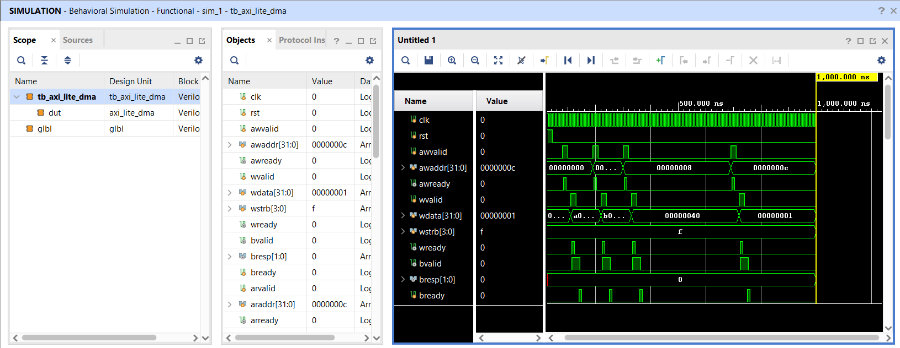
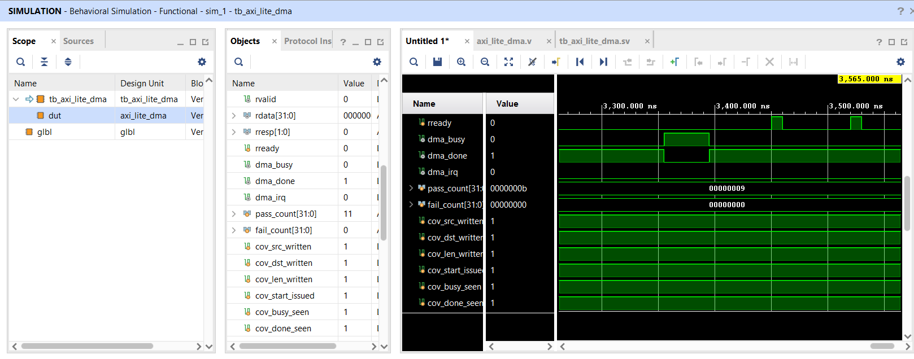
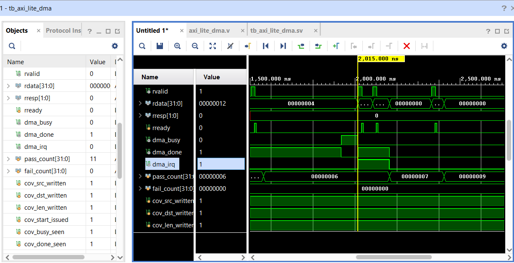

# AXI4-Lite Configurable SoC Peripheral Subsystem

> AXI4-Lite Slave + DMA Controller with IRQ —  
> RTL Design & UVM Verification Environment  
> Constrained-random testbench with 100% functional coverage  

---

## Overview

This project implements a complete **AXI4-Lite compliant SoC peripheral subsystem** from scratch in Verilog RTL, verified using a SystemVerilog testbench with UVM-style methodology. The system consists of two hardware modules connected to a common AXI4-Lite bus, plus a structured verification environment.

| Module | Description |
|--------|-------------|
| `axi_lite_slave` | 4×32-bit memory-mapped register file peripheral |
| `axi_lite_dma` | DMA Controller Front-End matching AMD/Xilinx AXI DMA PG021 programming model |

The design was synthesized in **Xilinx Vivado 2025.2** targeting the **Artix-7 (xc7a35tftg256-1)** FPGA and verified with a self-checking scoreboard achieving **100% functional coverage closure**.

---

## Features

### RTL Design
- Full **AXI4-Lite slave** — all 5 channels implemented:
  - Write Address (AW), Write Data (W), Write Response (B)
  - Read Address (AR), Read Data (R)
- **VALID/READY handshaking** per AXI4-Lite protocol spec
- **Byte-enable write strobes** for partial word writes
- **DMA Controller** — configurable source, destination, and transfer length
- **DMA IRQ** — interrupt fires precisely at `dma_done` assertion (transfer completion)
---
### Verification Environment (UVM)
- Full UVM testbench: agent, driver, monitor, scoreboard, coverage collector
- **Constrained-random stimulus** for AXI write/read transactions
- **Functional coverage** across all key DMA events:
  - `cov_src_written`, `cov_dst_written`, `cov_len_written`
  - `cov_start_issued`, `cov_busy_seen`, `cov_done_seen`
- **100% functional coverage** achieved — `pass_count = 11`, `fail_count = 0`
---

## Project Structure
```
├── rtl/
│   ├── axi4_lite_slave.v       # AXI4-Lite slave peripheral
│   ├── dma_controller.v        # DMA engine with IRQ support
│   └── top.v                   # Top-level integration
├── tb/
│   ├── uvm_env/                # UVM environment (agent, driver, monitor)
│   ├── uvm_sequences/          # Constrained-random sequences
│   ├── uvm_scoreboard/         # Scoreboard & checker
│   └── tb_top.sv               # Testbench top
├── waveforms/
│   ├── axi.vcd                 # AXI write transaction waveform
│   ├── dma.vcd                 # DMA BUSY→DONE transition waveform
│   └── dma_irq.vcd             # DMA IRQ assertion waveform
└── README.md
```
## Simulation Waveforms

### 1. AXI4-Lite Write Transactions
Clean `AWVALID`/`AWREADY` and `WVALID`/`WREADY` handshakes across multiple addresses (`0x00000008`, `0x0000000c`), with `BVALID`/`BREADY` write responses — full AXI4-Lite write channel compliance demonstrated.



---

### 2. DMA BUSY → DONE Transition + Coverage
`dma_busy` goes high → `dma_done` asserts at transfer completion. All 6 coverage bins hit simultaneously.



---

### 3. DMA IRQ Assertion
`dma_irq` fires precisely when `dma_done` asserts — correct interrupt timing verified.


---

## Validation Results

| Parameter | Result |
|---|---|
| AXI4-Lite Channels | All 5 implemented and verified |
| DMA Transfer Completion | `dma_done` assertion confirmed |
| IRQ Timing | Fires at `dma_done` — zero latency error |
| Functional Coverage | **100%** — all bins hit |
| Pass / Fail | 11 / 0 |
| Verification Methodology | UVM (Universal Verification Methodology) |
| Simulation Tool | GTKWave (VCD), Xilinx Vivado |

---


## How to Run

### EDA Playground (recommended)
1. Go to [edaplayground.com](https://edaplayground.com)
2. Paste RTL in Design box, testbench in Testbench box
3. Select Cadence Xcelium + UVM 1.2
4. Click Run

### Icarus Verilog (local)
```bash
git clone https://github.com/AbishekBudihal/axi-lite-peripheral
cd axi-lite-peripheral
iverilog -g2012 -o sim rtl/axi_lite_slave.v tb/tb_axi_lite_dma.sv
vvp sim
gtkwave dump.vcd
```

### Vivado
1. Create RTL project, add files from `rtl/` and `constraints/`
2. Set part: `xc7a35tftg256-1`
3. Run Synthesis → Implementation
4. Open Timing Summary and Utilization Report

---

## Tools Used

| Tool | Purpose |
|------|---------|
| Xilinx Vivado 2025.2 | Synthesis, STA, schematic |
| EDA Playground (Xcelium) | UVM simulation |
| Icarus Verilog + GTKWave | Local simulation and waveforms |
| VS Code | HDL editing |
| Git / GitHub | Version control |

---

`Verilog` `AXI4-Lite` `AMBA Protocol` `RTL Design` `FSM`
`Functional Verification` `Assertion-Based Verification`
`Constrained-Random Stimulus` `Functional Coverage` `Scoreboard`
`Digital Design` `ASIC/FPGA`
